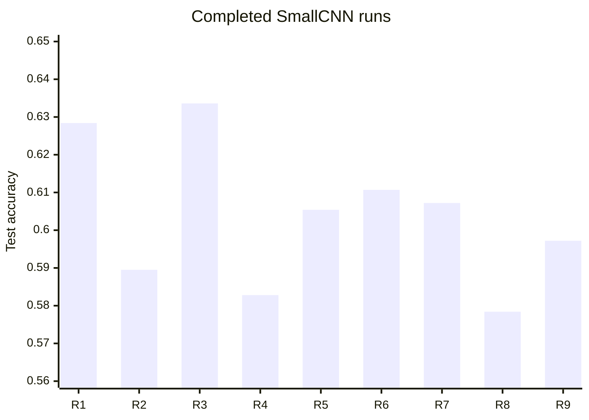
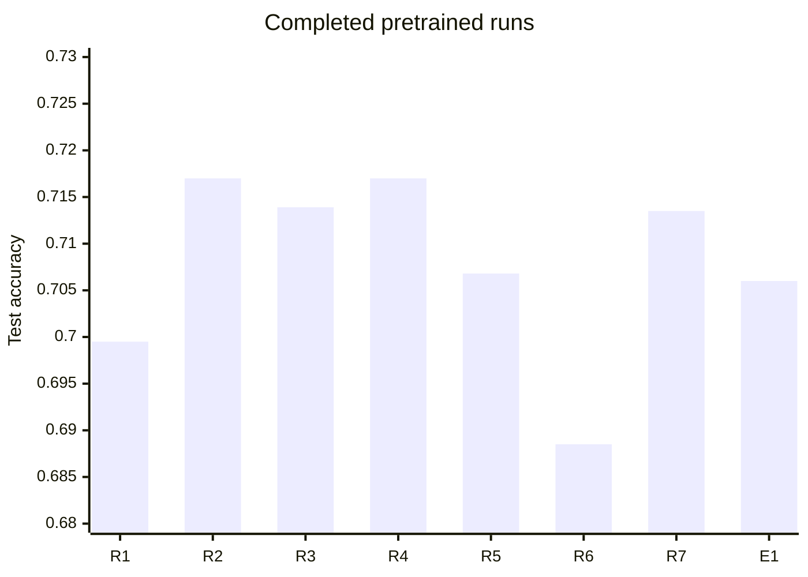

# CINIC-10 Image Classification with Convolutional and Pretrained Neural Networks

## Abstract

This report studies image classification on CINIC-10, a 10-class dataset designed to sit between CIFAR-10 and ImageNet in difficulty and scale [1]. The repository implements a small custom convolutional network, pretrained ResNet18, and pretrained EfficientNet-B0, together with standard augmentation, stronger augmentation, MixUp, CutMix, two-phase transfer learning, optimizer and scheduler variants, and deterministic seeding [2]-[9]. Based on the completed `metrics.json` files in `runs/`, the pretrained backbones clearly outperform the custom SmallCNN baseline, with the best completed model reaching 71.70% test accuracy. The archive does not contain any completed reduced-data or few-shot runs, and one ResNet18 rerun directory contains `best_model.pt` but no `metrics.json`; that attempt is treated as incomplete and excluded from quantitative summaries.

## Table of Contents

1. [Research Problem Description](#research-problem-description)
2. [Theoretical Introduction & Literature Review](#theoretical-introduction--literature-review)
3. [Experiment Description](#experiment-description)
4. [Results](#results)
5. [Conclusions](#conclusions)
6. [Application Instructions](#application-instructions)
7. [Bibliography](#bibliography)

## Research Problem Description

The goal of this project is to compare image classification strategies on CINIC-10 under realistic training constraints. CINIC-10 is an intentionally more demanding benchmark than CIFAR-10 because it combines images originating from both CIFAR-10 and ImageNet, which introduces greater variability and a mild distribution shift between the train, validation, and test subsets [1]. This makes it useful for evaluating not only whether a model can fit the training set, but also whether it generalizes across related but not identical image sources.

The practical question addressed here is which combination of architecture, optimization, augmentation, and transfer learning gives the best trade-off between accuracy and complexity. A small custom CNN provides a low-cost baseline, while pretrained ResNet18 and EfficientNet-B0 test whether ImageNet initialization improves performance on a moderate-size 32x32 image task. The source code also supports reduced-data and few-shot sampling, but the completed result archive does not contain runs that used those modes, so this report does not claim experimental evidence for them.

## Theoretical Introduction & Literature Review

Convolutional neural networks exploit spatial locality and parameter sharing, which makes them a natural fit for natural-image classification. Their hierarchical feature extraction is especially effective on small to medium-sized images, where early layers learn edges and textures and deeper layers learn class-specific structures. The custom SmallCNN in this repository follows this classical design pattern with a shallow stack of convolutions, batch normalization, pooling, and a linear classifier.

Transfer learning is central to modern vision systems when data or compute is limited. Instead of training a deep model from random initialization, a network pretrained on a large source corpus can be adapted to the target task by replacing or reinitializing the classifier head and then fine-tuning the remaining weights. This project uses that strategy with torchvision ResNet18 and EfficientNet-B0 backbones [3], [4].

Regularization matters because CINIC-10 is larger than CIFAR-10 but still small enough that overfitting remains a concern. Dropout [5], weight decay, and data augmentation are all used to control variance. The repository implements standard geometric and photometric augmentation, as well as stronger variants such as rotation, MixUp, and CutMix [7]-[9]. Adam and SGD serve as optimization baselines [6].

The overall methodology therefore combines a classical CNN baseline, transfer learning, and multiple regularization mechanisms in a single controlled training framework. That framework is deterministic at the seed level and records all arguments and metrics into per-run JSON files, which makes the experiment archive suitable for reproducible comparison [2].

## Experiment Description

### Data and preprocessing

All completed runs use the CINIC-10 train/validation/test folder layout under `data/cinic10/`. The data loader normalizes each image with the CINIC-10 channel statistics from the dataset documentation and applies either no augmentation, standard augmentation, or stronger augmentation [1]. Standard augmentation consists of random crop, horizontal flip, and mild color jitter. Strong augmentation replaces the color jitter with random rotation. The loader also supports train-fraction and few-shot sampling, but no completed run in `runs/` used either option.

### SmallCNN sweep

The SmallCNN experiments test a lightweight baseline implemented directly in `src/models.py`. The model has three convolutional blocks followed by adaptive average pooling and a dropout-regularized linear classifier. All SmallCNN runs use single-phase training in `src/train.py`, so the full network is trainable from the start. The sweep varies learning rate, dropout, weight decay, optimizer, augmentation policy, and advanced augmentation. Completed runs use 30 epochs, batch size 256, seed 42, and the same CINIC-10 train/validation/test split.

### Pretrained ResNet18 sweep

The ResNet18 experiments use torchvision weights and the two-phase transfer strategy implemented in `src/train.py`. In phase one, the backbone is frozen and only the classifier head is trained. In phase two, the full network is unfrozen and fine-tuned at a lower learning rate. The completed ResNet18 runs vary the initial learning rate, scheduler choice, augmentation policy, advanced augmentation, and total training length. These runs use batch size 64 and seed 42. The code records the best validation checkpoint as `best_model.pt` and evaluates the final loaded model on the test split.

### Pretrained EfficientNet-B0 comparison

EfficientNet-B0 is included as a second pretrained backbone to check whether the ResNet18 result is architecture-specific. The recorded run uses the same two-phase transfer strategy and the same CINIC-10 preprocessing, but with an EfficientNet-B0 backbone, cosine learning-rate scheduling, and a 30-epoch schedule. This run is directly comparable to the pretrained ResNet18 family because it uses the same dataset, seed, and transfer protocol.

### Incomplete rerun

The archive also contains `runs/20260330-162532_resnet18_standard_adam_none_two_phase/best_model.pt` without a corresponding `metrics.json`. Because the run metadata and final metrics are missing, this attempt is treated as incomplete and excluded from all quantitative tables and figures.

## Results

The completed archive contains 17 usable `metrics.json` files: nine SmallCNN runs, seven completed pretrained-backbone runs, and one EfficientNet-B0 run. No exact configuration was repeated with multiple completed seeds, so the report cannot compute true replication mean and standard deviation for a repeated-trial cohort. Instead, Table 1 and Table 2 report each completed run individually, Table 3 gives descriptive family-level statistics over the completed runs, and Figures 1 and 2 visualize the same values. The incomplete rerun is documented separately and excluded from statistics.

### Table 1. Completed SmallCNN experiments.

| Run | Configuration summary | Best validation accuracy | Test accuracy |
| --- | --- | ---: | ---: |
| 20260325-165449 | SmallCNN, standard augmentation, Adam, lr=1e-3, wd=1e-4, dropout=0.3 | 0.6379 | 0.6284 |
| 20260327-152518 | SmallCNN, standard augmentation, Adam, lr=5e-3, wd=1e-4, dropout=0.3 | 0.6451 | 0.5895 |
| 20260327-162338 | SmallCNN, standard augmentation, Adam, lr=1e-3, wd=1e-4, dropout=0.0 | 0.6575 | 0.6336 |
| 20260328-173004 | SmallCNN, standard augmentation, Adam, lr=1e-3, wd=1e-3, dropout=0.3 | 0.6097 | 0.5828 |
| 20260328-200013 | SmallCNN, standard augmentation, SGD, lr=1e-2, wd=1e-4, dropout=0.3 | 0.6105 | 0.6054 |
| 20260328-204952 | SmallCNN, no augmentation, Adam, lr=1e-3, wd=1e-4, dropout=0.3 | 0.6315 | 0.6107 |
| 20260329-133115 | SmallCNN, strong augmentation, Adam, lr=1e-3, wd=1e-4, dropout=0.3 | 0.6133 | 0.6072 |
| 20260329-214725 | SmallCNN, standard augmentation, CutMix alpha=1.0, Adam, lr=1e-3 | 0.5985 | 0.5784 |
| 20260329-225729 | SmallCNN, standard augmentation, MixUp alpha=1.0, Adam, lr=1e-3 | 0.6151 | 0.5972 |

The SmallCNN table shows a relatively narrow performance band. The best SmallCNN result is the zero-dropout standard-augmentation run, which suggests that this baseline benefited more from reduced classifier regularization than from more aggressive input perturbation. Increasing the learning rate to 5e-3, increasing weight decay to 1e-3, or adding CutMix all reduced test accuracy. Strong augmentation and SGD were competitive but did not improve on the strongest standard-augmentation Adam setup.

### Figure 1. Test accuracy across the completed SmallCNN runs.



Figure 1 makes the same pattern visible visually: the SmallCNN runs cluster tightly and remain below 0.64 test accuracy. The chart supports the interpretation that this baseline is capacity-limited on CINIC-10, and that heavier augmentation alone does not close the gap to pretrained backbones.

### Table 2. Completed pretrained-backbone experiments and one incomplete rerun.

| Run | Configuration summary | Best validation accuracy | Test accuracy |
| --- | --- | ---: | ---: |
| 20260329-235853 | ResNet18 pretrained, two-phase, standard augmentation, Adam, lr=1e-4, 10 epochs | 0.6985 | 0.6995 |
| 20260330-003640 | ResNet18 pretrained, two-phase, standard augmentation, Adam, lr=1e-3, 20 epochs | 0.7166 | 0.7170 |
| 20260330-100101 | ResNet18 pretrained, two-phase, standard augmentation, Adam, cosine scheduler, 20 epochs | 0.7114 | 0.7139 |
| 20260330-114837 | ResNet18 pretrained, two-phase, standard augmentation, Adam, 20 epochs | 0.7166 | 0.7170 |
| 20260330-135607 | ResNet18 pretrained, two-phase, strong augmentation, Adam, 20 epochs | 0.7078 | 0.7068 |
| 20260330-151155 | ResNet18 pretrained, two-phase, standard augmentation, CutMix alpha=1.0, Adam, 20 epochs | 0.6889 | 0.6885 |
| 20260330-201928 | ResNet18 pretrained, two-phase, standard augmentation, MixUp alpha=1.0, Adam, 25 epochs | 0.7141 | 0.7135 |
| 20260331-013412 | EfficientNet-B0 pretrained, two-phase, standard augmentation, Adam, cosine scheduler, freeze 3 epochs, 30 epochs | 0.7066 | 0.7060 |
| 20260330-162532 | ResNet18 pretrained rerun; `best_model.pt` only, `metrics.json` missing | N/A | N/A |

The pretrained results are substantially stronger than the SmallCNN results. The best completed test accuracy in the archive is 71.70%, achieved by ResNet18 in the standard two-phase setup with Adam and 20 epochs. The cosine scheduler does not improve over that best setting, although it remains close. EfficientNet-B0 is competitive but does not surpass the strongest ResNet18 run. Strong augmentation and CutMix both reduce performance in this archive, while MixUp is close to the best baseline but still slightly lower. The 10-epoch ResNet18 run undertrains relative to the longer schedules, which is consistent with the higher capacity of the pretrained model and the need for more fine-tuning time.

### Figure 2. Test accuracy across the completed pretrained runs.



Figure 2 confirms that pretrained transfer learning dominates the custom CNN baseline. The spread among the pretrained runs is narrower than the spread among the SmallCNN runs, which is consistent with the stronger inductive bias and better optimization starting point provided by ImageNet pretraining [3], [4].

### Table 3. Descriptive family-level statistics for the completed runs.

These statistics are descriptive aggregates over the completed runs in each family. They are not replication statistics, because no exact configuration was repeated with multiple completed seeds.

| Family | Completed runs | Mean best validation accuracy | SD best validation accuracy | Mean test accuracy | SD test accuracy |
| --- | ---: | ---: | ---: | ---: | ---: |
| SmallCNN | 9 | 0.6243 | 0.0195 | 0.6037 | 0.0190 |
| Pretrained backbones | 8 | 0.7076 | 0.0108 | 0.7078 | 0.0099 |

Table 3 makes the overall pattern unambiguous. The pretrained family improves mean test accuracy by about 10 percentage points over SmallCNN and also shows lower dispersion across the completed runs. That combination of higher accuracy and lower spread is the clearest empirical result in the repository.

## Conclusions

The completed experiments support three main conclusions. First, the custom SmallCNN is a useful baseline but is clearly outperformed by pretrained transfer learning on CINIC-10. Second, within the recorded search space, the strongest pretrained result is a standard two-phase ResNet18 run rather than the larger EfficientNet-B0 model. Third, the more aggressive regularizers and augmentations tested here do not consistently help; in this archive, CutMix and strong augmentation often reduce accuracy, while MixUp is closer to neutral but still does not surpass the best ResNet18 baseline.

The likely explanation is that CINIC-10 benefits from pretrained feature extractors more than from heavier input perturbation. The source code already normalizes the dataset with CINIC-10 statistics and uses a deterministic seed, so the remaining gap is probably driven by model capacity and transfer quality rather than preprocessing noise [1]-[4]. The missing `metrics.json` for one ResNet18 rerun also shows that the record is not yet a fully replicated study. A more rigorous follow-up should freeze one final configuration and repeat it across several seeds so that mean, standard deviation, and possibly confidence intervals can be reported for the same exact setting.

Future work should therefore prioritize controlled replication of the best ResNet18 configuration, a proper reduced-data and few-shot study using the already implemented sampling hooks, and a broader search over scheduler, label smoothing, and finetuning schedules. If compute permits, the next comparison should also include confusion matrices and macro-averaged metrics to determine which classes benefit most from transfer learning and which remain difficult.

## Application Instructions

1. Create and activate a Python virtual environment.

   ```bash
   python -m venv .venv
   source .venv/bin/activate
   ```

2. Install the dependencies that match your hardware.

   ```bash
   pip install -r requirements-cuda.txt
   ```

   If CUDA is unavailable, use:

   ```bash
   pip install -r requirements-cpu.txt
   ```

3. Place CINIC-10 under `data/cinic10/` with `train/`, `valid/`, and `test/` subdirectories, each containing 10 class folders.

4. Run the smoke test on a lightweight machine if needed. The MacBook Air M2 is appropriate for this step, while the full training runs should be executed on the teammate's CUDA machine.

   ```bash
   python -m src.train --smoke_test
   ```

5. Reproduce the SmallCNN baseline family with the CLI entrypoint. The saved runs differ by learning rate, dropout, weight decay, optimizer, and augmentation choice, so the exact command should match the configuration recorded in each `metrics.json` file. A representative baseline is:

   ```bash
   python -m src.train \
     --model small_cnn \
     --augmentation standard \
     --advanced_aug none \
     --optimizer adam \
     --scheduler none \
     --epochs 30 \
     --batch_size 256 \
     --num_workers 8 \
     --seed 42 \
     --lr 0.001 \
     --weight_decay 0.0001 \
     --dropout 0.3
   ```

   To match the other SmallCNN runs in Table 1, change only the recorded hyperparameters: `--lr`, `--weight_decay`, `--dropout`, `--optimizer`, `--augmentation`, and `--advanced_aug`.

6. Reproduce the pretrained ResNet18 family with two-phase transfer learning. A representative configuration is:

   ```bash
   python -m src.train \
     --model resnet18 \
     --pretrained \
     --transfer_strategy two_phase \
     --augmentation standard \
     --advanced_aug none \
     --optimizer adam \
     --scheduler none \
     --epochs 20 \
     --batch_size 64 \
     --num_workers 0 \
     --seed 42 \
     --lr 0.001 \
     --finetune_lr 0.00005 \
     --freeze_epochs 5
   ```

   The recorded variants then change the scheduler, augmentation, advanced augmentation, total epochs, and in one early run the initial learning rate and classifier dropout argument.

7. Reproduce the EfficientNet-B0 run by using the same two-phase protocol with `--model efficientnet_b0`, `--scheduler cosine`, `--epochs 30`, and `--freeze_epochs 3`. The run metadata in `runs/20260331-013412_efficientnet_b0_standard_adam_cosine_two_phase/metrics.json` records the exact arguments.

8. Inspect the generated `runs/<timestamp>_<config>/metrics.json` file after each run. It contains the full argument set, per-epoch history, best validation accuracy, and final test metrics. The saved `best_model.pt` file stores the checkpoint with the best validation accuracy.

## Bibliography

[1] CINIC-10 dataset documentation, "CINIC-10: CINIC-10 Is Not ImageNet or CIFAR-10," `data/cinic10/README.md` in this repository.

[2] A. Paszke et al., "PyTorch: An Imperative Style, High-Performance Deep Learning Library," in *Advances in Neural Information Processing Systems*, 2019.

[3] K. He, X. Zhang, S. Ren, and J. Sun, "Deep Residual Learning for Image Recognition," in *Proceedings of the IEEE Conference on Computer Vision and Pattern Recognition (CVPR)*, 2016.

[4] M. Tan and Q. V. Le, "EfficientNet: Rethinking Model Scaling for Convolutional Neural Networks," in *Proceedings of the 36th International Conference on Machine Learning (ICML)*, 2019.

[5] N. Srivastava, G. Hinton, A. Krizhevsky, I. Sutskever, and R. Salakhutdinov, "Dropout: A Simple Way to Prevent Neural Networks from Overfitting," *Journal of Machine Learning Research*, vol. 15, no. 1, pp. 1929-1958, 2014.

[6] D. P. Kingma and J. Ba, "Adam: A Method for Stochastic Optimization," in *Proceedings of the 3rd International Conference on Learning Representations (ICLR)*, 2015.

[7] T. DeVries and G. W. Taylor, "Improved Regularization of Convolutional Neural Networks with Cutout," arXiv:1708.04552, 2017.

[8] H. Zhang, M. Cisse, Y. N. Dauphin, and D. Lopez-Paz, "mixup: Beyond Empirical Risk Minimization," in *Proceedings of the 6th International Conference on Learning Representations (ICLR)*, 2018.

[9] S. Yun, D. Han, S. J. Oh, S. Chun, J. Choe, and Y. Yoo, "CutMix: Regularization Strategy to Train Strong Classifiers with Localizable Features," in *Proceedings of the IEEE/CVF International Conference on Computer Vision (ICCV)*, 2019.
